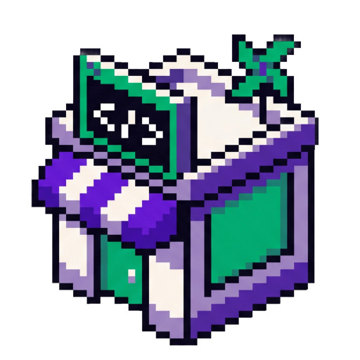

<p align="center">
  
</p>

# CodeMyShop

> **Open-source e-commerce PaaS for European sovereignty.** 100% TypeScript stack: Nuxt 4 + Drizzle + PostgreSQL. AGPL-3.0. Built in France in 2026.

[](https://www.gnu.org/licenses/agpl-3.0)
[](https://nuxt.com)
[](https://www.postgresql.org)
[]()

## Why CodeMyShop

- **Sovereign by design** — your code, your data, your server. France-based hosting or self-host. No CLOUD Act exposure.
- **Modern unified stack** — Nuxt 4 SSR + Drizzle ORM + PostgreSQL 17 with pgvector + Redis 7 + nginx. One Node process, atomic deploys.
- **Open-core, real OSS** — the free Community edition is a complete production platform, not a crippled trial. Paid hosted tiers add managed ops and premium packs.
- **Honest economics** — Community self-host is 0% commission, you keep 100% of revenue. Hosted tiers carry a transparent 0.25% platform slice (vs 1.5–2% on Shopify, BigCommerce, Squarespace).
- **Built-in AI** — autonomous SEO content generation, enriched product sheets, structured data for LLM visibility.

## Status

**Alpha — public preview.** The core runtime has been stable in production on three internal tenants since April 2026. We're publishing the source under AGPL-3.0 to invite community installs and feedback before the hosted plans (Starter / Growth / Pro / Custom) open to the public.

If you install it and reach a working production site → please open an issue or DM us. We want 2–3 documented external installs to confirm the path works end-to-end.

## Editions & pricing

CodeMyShop is **open-core** with one free edition and four hosted tiers:

| | **Community** | **Starter** | **Growth** | **Pro** | **Custom** |
|---|:---:|:---:|:---:|:---:|:---:|
| **Price** | Free (AGPL-3.0) | **10 €/mo** | **80 €/mo** | **400 €/mo** | Talk to us |
| **Target** | Devs, agencies, self-hosters | Solo founder, < 250 k€ revenue | SMB growing, 250 k–500 k€ | SMB scaling, 500 k–1.5 M€ | Mid-market, regulated, multi-shop, white-label |
| **Hosting** | Self-host | Hosted EU (shared subdomain) | Hosted EU (custom domain) | Hosted EU (custom domain) | Multi-region, dedicated cluster, BYOC option |
| **cs_payment slice** | 0% (bring your own PSP) | 0.25% | 0.25% | 0.25% | configurable |
| **Support** | GitHub | Community Discord | Email 48 h | Email 24 h | 4 h business + 24/7 on-call + 99.9% SLA |
| **Setup** | Self-serve docs | Self-serve onboarding | Self-serve onboarding | Guided onboarding | White-glove onboarding |

Full feature matrix, pack breakdown (AI / Data / SEO / Banking / Vertical Food–Vape–Fashion–Jewelry) and capability-by-capability split → **[core/EDITIONS.md](core/EDITIONS.md)**.

Hosted tiers will open at [codemyshop.com](https://codemyshop.com).

## Quick start (Community, self-host)

Prerequisites: **Node 22+**, **PostgreSQL 17+**, **Redis 7+**, Docker recommended.

```bash
git clone https://github.com/codemyshop/codemyshop.git
cd codemyshop/core
npm install
npm run dev
```

> Alpha note: the full standalone install bundle (`.env.example`, Docker Compose, Ansible playbook for VPS provisioning, SSL automation, Postgres seed) is being extracted from our private monolith and will land as a versioned release. The recipe above starts the dev server against a local Postgres for now. Watch [releases](https://github.com/codemyshop/codemyshop/releases) for the first packaged install.

## Architecture

A single Node.js process (Nuxt 4 with the Nitro server) handles:

- **product catalog** — PostgreSQL via Drizzle ORM, schema in [`core/server/db/schema-pg/`](core/server/db/schema-pg/)
- **storefront experience** — Vue 3 SSR with a light theme (responsive, accessible)
- **admin hub & back-office** — single integrated app, no extra Node service
- **AI workers** — autonomous SEO content via OpenAI / Anthropic / Mistral, pluggable

No microservices, no API bridge between two systems: one atomic deploy with a single `git push`.

## Stack

| Layer | Tech | Why |
|-------|------|-----|
| Runtime | Nuxt 4 (Nitro server, Vue 3 SSR) | Single TS codebase for storefront + admin + API |
| ORM | Drizzle ORM | TypeScript-native, no codegen, easy raw SQL escape hatch |
| Database | PostgreSQL 17 + pgvector | Mature, sovereign, vector embeddings for AI |
| Cache | Redis 7 | Sessions, rate limit, ephemeral state |
| Web server | nginx | Reverse proxy, SSL, static assets, rate limit |
| AI providers | OpenAI / Anthropic / Mistral | Pluggable, configured via env |
| Analytics | Matomo (self-hosted) | First-party data, GDPR-friendly |
| Process manager | PM2 | Graceful reload, monitoring, log aggregation |

## Multi-tenant by design

A single CodeMyShop codebase powers many shops. Each tenant is configuration + theme + a dedicated database — the core stays a single canonical codebase. That's how we keep one mainline up to date for everyone without forks.

Tenant configuration lives under [`core/config/clients/`](core/config/clients/) in self-host setups (one TypeScript module per tenant — theme tokens, locales, feature flags). The Managed plans add per-tenant DB isolation on our hosted infrastructure.

## Community

- **GitHub Issues** — bugs, feature requests, install help.
- **GitHub Discussions** — design questions, feedback, public roadmap.
- **Discord and Twitter/X** — opening alongside the hosted plans launch; subscribe to repo releases until then.

## Contributing

PRs welcome. CI must pass and we follow [Conventional Commits](https://www.conventionalcommits.org/). Until the dedicated `CONTRIBUTING.md` lands, please open an issue describing the change before sending a sizeable patch — it saves everyone's time.

For security issues, please email **security@codemyshop.com** privately. Do **not** open a public issue.

## License

**AGPL-3.0** — see [LICENSE](LICENSE).

> The AGPL clause requires SaaS forks to publish their modifications under AGPL too. It protects the commons against predatory forks (the MongoDB / Elastic / Plausible model). Private and self-hosted use stays unrestricted.

## Trademark

**CodeMyShop®** is a registered trademark at the EUIPO. You can fork and self-host freely, but a fork cannot present itself under the "CodeMyShop" name without prior written authorization.

## Acknowledgments

Built in France in 2026 with [Claude Code](https://claude.com/claude-code) by Alexandre Carette and his Synedre of AI agents. Inspired by the open-source ethos of MongoDB, Plausible, n8n, and Supabase.
